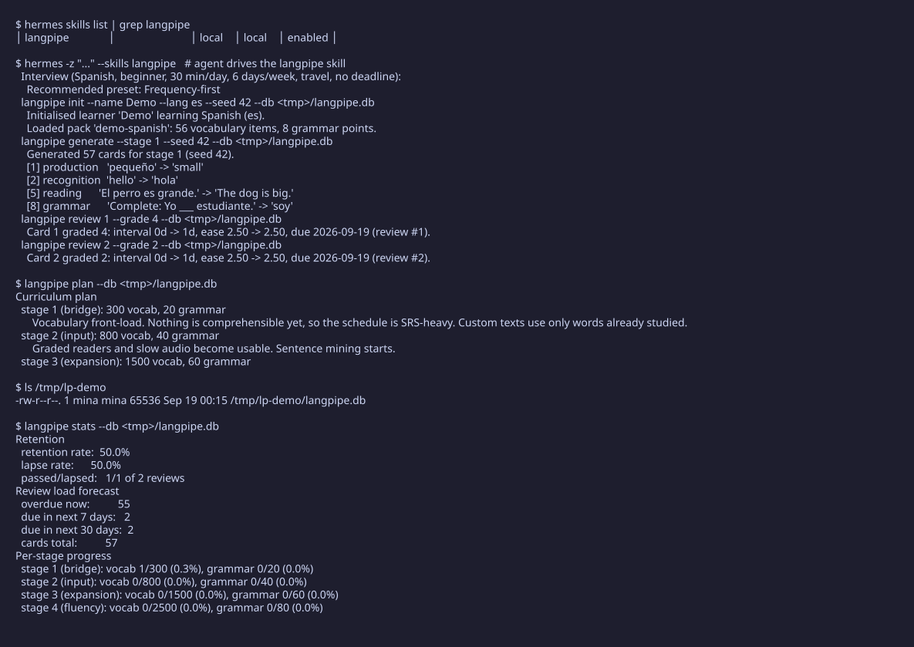
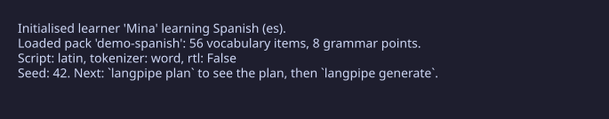
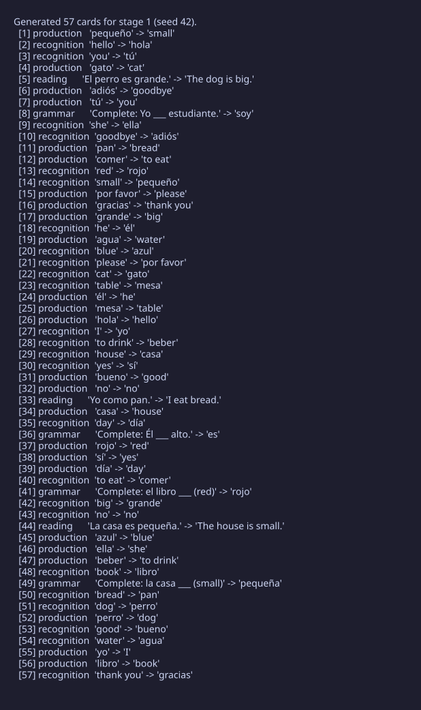
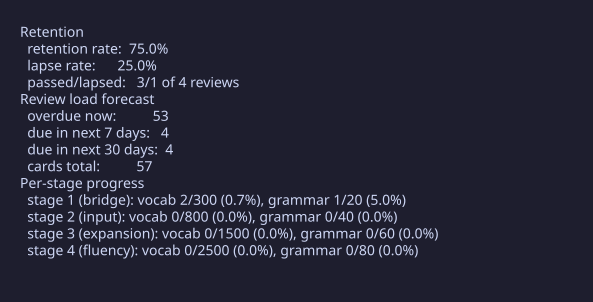

# langpipe

langpipe is a command-line tool that turns a list of words and grammar points into a working study plan. You give it a language pack, it generates practice cards, schedules your reviews with spaced repetition, and then tells you the honest numbers: how much you actually retained, how much you forgot, and what is coming due. The point is not another flashcard app. The point is knowing whether the hours you spend are doing anything.


[](https://github.com/mina-atef-00/langpipe/actions/workflows/ci.yml)




## Hermes plugin

langpipe is also a Hermes plugin. The bundled skill runs a guided learner
interview (language, motivation, time budget, deadline, style, history),
matches the answers to a proven preset, then drives the langpipe CLI to
produce the plan, generate practice cards, record reviews, and report
retention analytics:

interview -> plan -> generate -> review -> sync

Install from the local plugin directory:

```bash
cp -r ~/.hermes/plugins/langpipe ~/.hermes/skills/langpipe
```

See SPEC.md for the technical detail on how the skill and the CLI divide the
work.

## Sixty seconds

Start a learner and load the bundled demo Spanish pack:

```bash
langpipe init --name Mina --lang es --seed 42
```



Generate the practice cards for stage 1:

```bash
langpipe generate --stage 1 --seed 42
```



Study a few cards, then record what happened. Grade 3 or above is a pass, below 3 means you forgot it:

```bash
langpipe review 2 --grade 4
```


After a session, see how you are doing:

```bash
langpipe stats
```



That is the whole loop. Init once, generate, review as you study, check stats whenever you want to know if it is working.

## Install

You need Python 3.11 or newer.

```bash
git clone <this repo>
cd langpipe
python -m venv .venv
.venv/bin/pip install -e .
```

## Daily use

- `langpipe init` — start a learner and load a language pack (once).
- `langpipe plan` — look at the four-stage curriculum and its targets.
- `langpipe generate` — create the practice cards for a stage.
- `langpipe cards` — list your cards and what is due.
- `langpipe review <card-id> --grade 0-5` — record one review after studying that card.
- `langpipe stats` — retention, lapse rate, upcoming workload, progress per stage.
- `langpipe sync` — push your cards into Anki, if you use both.

It works for any language. The code never branches on which language you are learning; a Spanish pack, an Arabic pack, and a Chinese pack are just different data files. The bundled demo pack is a starter — add your own vocabulary to make it yours.

Want the internal details — how the scheduling math works, what is stored where, how sync stays idempotent? Read [SPEC.md](SPEC.md).

## Status

New tool, early days. The pipeline runs end to end and the test suite is green, but treat it as a project to poke at, not polished software.

## License

MIT. See the LICENSE file.
