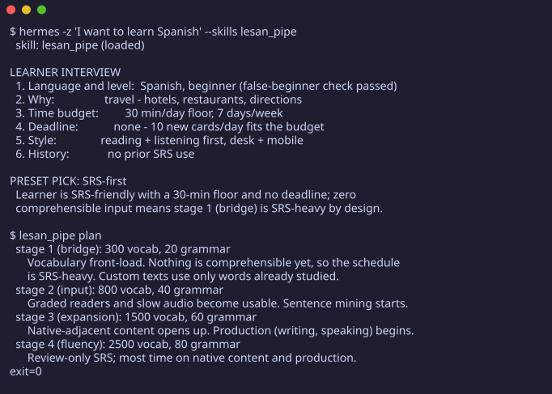
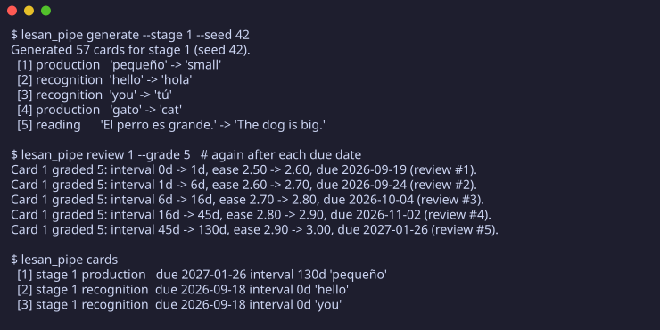
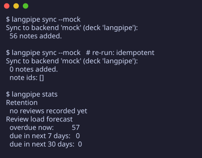

# lesan_pipe

lesan_pipe turns a list of words and grammar points into a working study plan: practice cards generated from a language pack, reviews scheduled with spaced repetition, and honest numbers on what you retained, what you forgot, and what is coming due. The point is not another flashcard app. The point is knowing whether the hours you spend are doing anything.

Three surfaces, one pipeline. The **MCP server** exposes the whole loop as seven tools for any agent host. The **Hermes plugin** adds a skill that runs the guided learner interview and drives those tools. The **CLI** underneath owns every number and works on its own.


[](https://github.com/mina-atef-00/lesan_pipe/actions/workflows/ci.yml)


| In action | What you are looking at |
|---|---|
|  | The lesan_pipe skill loaded in Hermes: the learner interview runs, the SRS-first preset is picked, and the four-stage plan is printed. |
|  | `generate` builds 57 practice cards; repeated `review` runs grow the SM-2 interval from 0d to 130d with a rising ease factor. |
|  | `sync` pushes 56 notes; a re-run adds 0 — sync is idempotent. `stats` reports retention and the review load forecast. |

## MCP server

`hermes-plugin/server/lesan_pipe_mcp.py` is a stdio MCP server (standard library only) that forwards every tool call to the real `lesan_pipe` console script as a subprocess. Seven tools, in pipeline order:

| Tool | What it runs |
|---|---|
| `lesan_pipe_init` | `lesan_pipe init` — create learner, curriculum and database from a pack. Refuses to overwrite an existing database unless `confirm_overwrite: true`. |
| `lesan_pipe_plan` | `lesan_pipe plan` — phased curriculum with per-stage targets. |
| `lesan_pipe_generate` | `lesan_pipe generate` — practice cards for one stage. |
| `lesan_pipe_cards` | `lesan_pipe cards` — list stored cards, optionally by stage. |
| `lesan_pipe_review` | `lesan_pipe review` — record one graded review (SM-2). |
| `lesan_pipe_stats` | `lesan_pipe stats` — retention, lapses, due forecast. |
| `lesan_pipe_sync` | `lesan_pipe sync` — export to Anki through AnkiConnect (or `--mock`). |

Two rules the server will not break: the CLI owns every number (nothing here computes an interval or a rate), and failures are loud (a non-zero exit or a missing executable comes back as a tool error with the real stderr, never as an empty success).

Try it by hand:

```bash
printf '%s\n' \
  '{"jsonrpc":"2.0","id":1,"method":"initialize","params":{"protocolVersion":"2025-06-18"}}' \
  '{"jsonrpc":"2.0","id":2,"method":"tools/list"}' \
  | python3 hermes-plugin/server/lesan_pipe_mcp.py
```

The review database defaults to `${PLUGIN_DATA}/lesan_pipe.db` (per call: `db`; for the whole server: `LESAN_PIPE_DB`). `LESAN_PIPE_BIN` points at an explicit console script, `LESAN_PIPE_TIMEOUT` raises the per-call timeout. Full detail lives in [hermes-plugin/README.md](hermes-plugin/README.md).

## Hermes plugin

`hermes-plugin/` is the catalog-ready package (manifest, MCP entry, skill, server). The bundled skill (`skills/lesan_pipe/SKILL.md`) runs a guided learner interview (language, motivation, time budget, deadline, style, history), matches the answers to a proven preset, then drives the pipeline:

interview -> plan -> generate -> review -> sync

The skill is a prompt file, not code: it adds no model inference to the pipeline. Everything it does, it does by calling the tools above (or the CLI documented below). Grounded references for its claims live in `hermes-plugin/references/`.

See SPEC.md for the technical detail on how the skill and the CLI divide the work.

## CLI in sixty seconds

Start a learner and load the bundled demo Spanish pack:

```bash
lesan_pipe init --name Mina --lang es --seed 42
```


Generate the practice cards for stage 1:

```bash
lesan_pipe generate --stage 1 --seed 42
```


Study a few cards, then record what happened. Grade 3 or above is a pass, below 3 means you forgot it:

```bash
lesan_pipe review 2 --grade 4
```


After a session, see how you are doing:

```bash
lesan_pipe stats
```


That is the whole loop. Init once, generate, review as you study, check stats whenever you want to know if it is working.

## Install

You need Python 3.11 or newer, and `uv` (or `pipx` as a fallback).

```bash
git clone <this repo>
cd lesan_pipe
./scripts/install.sh
```

That one command installs the `lesan_pipe` CLI editable from this checkout and links the Hermes plugin at this checkout, so editing the repo changes all three surfaces without reinstalling. This repo is not published to PyPI, so `pip install lesan_pipe` will not give you this tool — install from the checkout.

## Daily use

- `lesan_pipe init` — start a learner and load a language pack (once).
- `lesan_pipe plan` — look at the four-stage curriculum and its targets.
- `lesan_pipe generate` — create the practice cards for a stage.
- `lesan_pipe cards` — list your cards and what is due.
- `lesan_pipe review <card-id> --grade 0-5` — record one review after studying that card.
- `lesan_pipe stats` — retention, lapse rate, upcoming workload, progress per stage.
- `lesan_pipe sync` — push your cards into Anki, if you use both.

It works for any language. The code never branches on which language you are learning; a Spanish pack, an Arabic pack, and a Chinese pack are just different data files. The bundled demo pack is a starter — add your own vocabulary to make it yours.

Want the internal details — how the scheduling math works, what is stored where, how sync stays idempotent? Read [SPEC.md](SPEC.md).

## Status

New tool, early days. The pipeline runs end to end and the test suite is green, but treat it as a project to poke at, not polished software.

What "green" means concretely, so it can be checked rather than believed:
`pytest` runs 76 tests, `ruff check .` is clean, and `mypy` in strict mode
reports no issues; CI (`.github/workflows/ci.yml`) runs those same three on
Python 3.11 for every push, plus a plugin-packaging check.

## License

MIT. See the LICENSE file.
